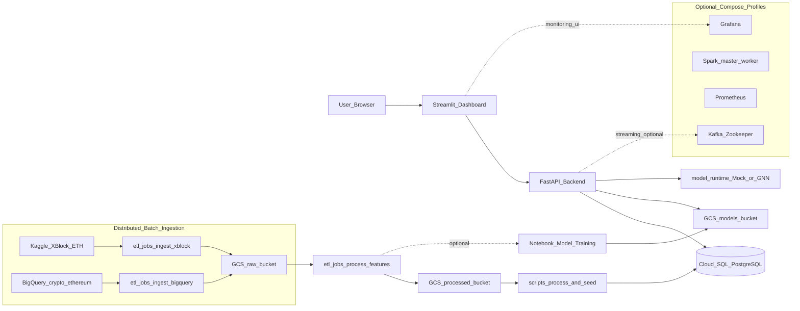

# Ethereum Phishing Detection Platform

> **BDA501 Final Project** — GNN-based Ethereum phishing detection on a
> hybrid **local compute + GCP storage** stack.
>
> **Canonical architecture:** `[documentation/ARCHITECTURE.md](documentation/ARCHITECTURE.md)`
>
> Last updated: 2026-04-10

This README is the **single place** to understand how to build the platform
from an empty checkout all the way to a running API and dashboard backed by
real GCS buckets and a real Cloud SQL instance. Anything that is not in this
README or in `documentation/ARCHITECTURE.md` is either legacy or
support material.

---

## Table of contents

1. [Overview](#1-overview)
2. [System architecture](#2-system-architecture)
3. [Prerequisites](#3-prerequisites)
4. [Accounts and secrets](#4-accounts-and-secrets)
5. [Build pipeline from scratch](#5-build-pipeline-from-scratch)
  - [5.1 Clone and configure](#51-clone-and-configure)
  - [5.2 Provision GCP](#52-provision-gcp)
  - [5.3 Initialize the Cloud SQL schema](#53-initialize-the-cloud-sql-schema)
  - [5.4 Distributed batch ingestion (Kaggle + BigQuery → GCS)](#54-distributed-batch-ingestion-kaggle--bigquery--gcs)
  - [5.5 Feature engineering (GCS raw → GCS processed)](#55-feature-engineering-gcs-raw--gcs-processed)
  - [5.6 Seed Cloud SQL from processed features](#56-seed-cloud-sql-from-processed-features)
  - [5.7 Start the runtime stack](#57-start-the-runtime-stack)
  - [5.8 Verify the stack](#58-verify-the-stack)
6. [Run profiles](#6-run-profiles)
7. [Project structure](#7-project-structure)
8. [Troubleshooting](#8-troubleshooting)

---

## 1) Overview

This platform classifies Ethereum addresses as phishing or legitimate using
a GraphSAGE-style GNN trained on the XBlock-ETH labeled transaction network,
optionally augmented with historical transactions from BigQuery's public
`crypto_ethereum` dataset.

- **Compute** runs locally under Docker Compose (FastAPI + Streamlit, plus
optional Kafka, Spark, Prometheus, Grafana).
- **State** lives on GCP: object storage on GCS (raw / processed / models
buckets) and relational storage on Cloud SQL PostgreSQL.
- **Model mode** is `mock-first`. The API boots against a mock predictor and
will switch to the real GNN as soon as a `model.pt` is present in
`model_artifacts/current/` or in `gs://$GCS_BUCKET_MODELS/models/current/`.

---

## 2) System architecture

The ingestion step is **distributed across two external sources** — the
**XBlock-ETH dataset on Kaggle** and the `**crypto_ethereum` public dataset on
BigQuery** — both landing into the same GCS raw bucket under disjoint
prefixes. Feature engineering then reads exclusively from GCS, so the
downstream code path is identical regardless of which ingest job produced
the data.




The authoritative component table, exact GCS paths, and list of things that
are **not** in the architecture (and why) live in
`[documentation/ARCHITECTURE.md](documentation/ARCHITECTURE.md)`.

---

## 3) Prerequisites


| Tool                                  | Minimum | Purpose                                   |
| ------------------------------------- | ------- | ----------------------------------------- |
| Python                                | 3.10+   | ETL scripts, seeding, local sanity checks |
| Docker Engine                         | 20.10+  | Container runtime for the stack           |
| Docker Compose                        | v2+     | Multi-service orchestration               |
| Google Cloud SDK (`gcloud`, `gsutil`) | latest  | Provision GCP, stage data                 |
| `bq` CLI (part of Cloud SDK)          | latest  | BigQuery sanity checks (optional)         |
| PostgreSQL client (`psql`)            | 14+     | Apply schema, inspect data                |
| Git                                   | 2.0+    | Source control                            |


Quick sanity check:

```bash
python3 --version
docker --version
docker compose version
gcloud --version
gsutil version -l
psql --version
```

If `pip` is missing from `PATH`, always invoke it as `python3 -m pip`.

---

## 4) Accounts and secrets

**Accounts**

- Google Cloud project with billing enabled (Cloud SQL and BigQuery both
require it).
- Kaggle account with an API token (`~/.kaggle/kaggle.json`) so that
`etl/jobs/ingest_xblock.py` or `scripts/download_data.py` can fetch the
XBlock-ETH dataset.

**Secrets that must be present in `.env`** (`cp .env.example .env`):

- `GCP_PROJECT_ID`
- `GOOGLE_APPLICATION_CREDENTIALS` (path to a service-account JSON under
`credentials/` — keep it out of git)
- `CLOUD_SQL_HOST`, `CLOUD_SQL_CONNECTION_NAME`
- `POSTGRES_DB`, `POSTGRES_USER`, `POSTGRES_PASSWORD`
- `GCS_BUCKET_RAW`, `GCS_BUCKET_PROCESSED`, `GCS_BUCKET_MODELS`
- `INFERENCE_MODE` (`auto` by default; leave as-is unless you have a real
`model.pt`)

Never commit `credentials/`, `.env`, or any service-account JSON.

---

## 5) Build pipeline from scratch

The pipeline below takes an empty checkout to a running dashboard. The
numbered sub-steps map 1:1 to the system architecture diagram: **provision →
ingest (Kaggle + BigQuery → GCS) → process features → seed Cloud SQL →
serve**.

### 5.1 Clone and configure

```bash
git clone <your-repo-url>
cd bda501-final
cp .env.example .env
# Edit .env and fill every variable listed in section 4.
```

### 5.2 Provision GCP

Authenticate and pick a project:

```bash
gcloud auth login
gcloud auth application-default login

export GCP_PROJECT_ID="<your-project-id>"
gcloud config set project "$GCP_PROJECT_ID"

gcloud services enable \
  sqladmin.googleapis.com \
  storage.googleapis.com \
  bigquery.googleapis.com \
  iam.googleapis.com
```

Create the Cloud SQL instance and two logical databases (one for the app,
one for MLflow):

```bash
export CLOUD_SQL_HOST=$(grep CLOUD_SQL_HOST .env | cut -d= -f2)
export PGPASSWORD=$(grep POSTGRES_PASSWORD .env | cut -d= -f2)
gcloud sql instances create ethphish-db \
  --database-version=POSTGRES_16 \
  --edition=ENTERPRISE \
  --tier=db-custom-1-3840 \
  --region=asia-southeast1 \
  --storage-size=10GB \
  --storage-auto-increase \
  --availability-type=zonal

gcloud sql users set-password postgres \
  --instance=ethphish-db \
  --password="$POSTGRES_PASSWORD"

gcloud sql databases create eth_phishing --instance=ethphish-db
gcloud sql databases create mlflow       --instance=ethphish-db

# Authorize your current IP for direct psql access
MY_IP=$(curl -s ifconfig.me)
gcloud sql instances patch ethphish-db --authorized-networks="${MY_IP}/32"

# Record CLOUD_SQL_HOST into .env
gcloud sql instances describe ethphish-db \
  --format="value(ipAddresses[0].ipAddress)"
```

Create the three GCS buckets — **raw**, **processed**, **models** — which
back the architecture diagram above:

```bash
# Load bucket names from .env (required before using $GCS_BUCKET_*)
set -a
source .env
set +a

export GCS_REGION="asia-southeast1"
echo "RAW=$GCS_BUCKET_RAW PROCESSED=$GCS_BUCKET_PROCESSED MODELS=$GCS_BUCKET_MODELS"

# Guard: fail fast if any bucket variable is empty
test -n "$GCS_BUCKET_RAW" && test -n "$GCS_BUCKET_PROCESSED" && test -n "$GCS_BUCKET_MODELS"

gsutil mb -l "$GCS_REGION" "gs://$GCS_BUCKET_RAW"
gsutil mb -l "$GCS_REGION" "gs://$GCS_BUCKET_PROCESSED"
gsutil mb -l "$GCS_REGION" "gs://$GCS_BUCKET_MODELS"
```

Create a service account with the roles the ETL jobs and the API need, and
download a key into `credentials/`:

```bash
gcloud iam service-accounts create ethphish-sa \
  --display-name="Ethereum Phishing Detection Platform"

export SA_EMAIL="ethphish-sa@${GCP_PROJECT_ID}.iam.gserviceaccount.com"

for role in \
    roles/cloudsql.client \
    roles/storage.objectAdmin \
    roles/bigquery.jobUser \
    roles/bigquery.dataViewer; do
  gcloud projects add-iam-policy-binding "$GCP_PROJECT_ID" \
    --member="serviceAccount:${SA_EMAIL}" \
    --role="$role"
done

mkdir -p credentials
gcloud iam service-accounts keys create credentials/gcp-service-account.json \
  --iam-account="$SA_EMAIL"
echo "credentials/" >> .gitignore
```

### 5.3 Initialize the Cloud SQL schema

`infra/postgres/init.sql` is the canonical schema — 11 tables plus a handful
of dashboard views, in the exact order required by the foreign keys.

```bash
psql -h "$CLOUD_SQL_HOST" -U postgres -d eth_phishing -f infra/postgres/init.sql

# Sanity check
psql -h "$CLOUD_SQL_HOST" -U postgres -d eth_phishing -c "\dt"
```

### 5.4 Distributed batch ingestion (Kaggle + BigQuery → GCS)

Install the ETL dependencies once:

```bash
python3 -m pip install -r etl/requirements.txt
```

The ingestion step is distributed across two independent jobs. Both write
into the **same** `gs://$GCS_BUCKET_RAW` bucket under disjoint prefixes, so
they can run in any order (or in parallel on separate hosts).

**A. Kaggle — XBlock-ETH labeled transaction network.**
This is the primary training dataset. `etl/jobs/ingest_xblock.py` reads the
local CSV export (downloaded via the Kaggle API) and uploads Parquet to
`gs://$GCS_BUCKET_RAW/xblock/`.

```bash
# Pull the XBlock-ETH dataset locally via kagglehub
python3 scripts/download_data.py

# Upload XBlock Parquet to GCS raw bucket
python3 scripts/run_etl.py --source xblock \
  --data-dir data/raw/xblock \
  --bucket-raw "$GCS_BUCKET_RAW"
```

If you are memory-constrained and want to stream the full XBlock pickle
straight to GCS (plus a 5 000-address representative subset for feature
work), use the helper:

```bash
python3 scripts/ingest_xblock_pkl.py --skip-full-parse
```

**B. BigQuery — `bigquery-public-data.crypto_ethereum`.**
This is the large-history backfill. `etl/jobs/ingest_bigquery.py` runs a
date- and row-bounded query against the public dataset and writes Parquet
under `gs://$GCS_BUCKET_RAW/transactions/bigquery/year=YYYY-MM/`.

```bash
# Cost estimate first (uses BigQuery dry-run, no rows moved)
python3 scripts/run_etl.py --source bigquery \
  --start-date 2024-01-01 --end-date 2024-01-31 \
  --limit 500000 --dry-run

# Real run once the estimate is acceptable
python3 scripts/run_etl.py --source bigquery \
  --start-date 2024-01-01 --end-date 2024-01-31 \
  --limit 500000
```

**Always run the `--dry-run` variant first** — BigQuery bills per bytes
processed, and unbounded `SELECT `* queries against `crypto_ethereum` are
expensive.

**C. Verify both prefixes are present.**

```bash
gsutil ls "gs://$GCS_BUCKET_RAW/xblock/"
gsutil ls "gs://$GCS_BUCKET_RAW/transactions/bigquery/"
```

You should see at least `xblock/transactions/transactions.parquet`,
`xblock/labels/labels.parquet`, and one or more
`transactions/bigquery/year=YYYY-MM/*.parquet` objects.

### 5.5 Feature engineering (GCS raw → GCS processed)

`etl/jobs/process_features.py` reads the raw Parquet from GCS, computes 12
node features per address (in/out degrees, ETH totals, avg/max tx value,
unique neighbor counts, account lifetime, failed-tx ratio, avg gas), builds
the edge index, and writes the result to
`gs://$GCS_BUCKET_PROCESSED/features/`.

```bash
# the whole pipeline in one go (xblock + bigquery + process)
python3 scripts/run_etl.py --source all \
  --data-dir data/raw/xblock \
  --start-date 2024-01-01 --end-date 2024-01-31 \
  --limit 500000 \
  --bucket-raw "$GCS_BUCKET_RAW" \
  --bucket-processed "$GCS_BUCKET_PROCESSED"
```

Expected outputs:

```
gs://$GCS_BUCKET_PROCESSED/features/node_features.parquet
gs://$GCS_BUCKET_PROCESSED/features/edge_index.parquet
gs://$GCS_BUCKET_PROCESSED/features/labels.parquet
gs://$GCS_BUCKET_PROCESSED/features/_summary.json
```

### 5.6 Seed Cloud SQL from processed features

`scripts/process_and_seed.py` reads the processed Parquet back from GCS,
registers a v1 `GraphSAGE` model in `model_versions` + `model_metrics`,
writes rows into `addresses`, `predictions`, and `alerts` (auto-alerting
above the 0.85 threshold), and uploads a `metadata.json` to
`gs://$GCS_BUCKET_MODELS/models/current/`.

```bash
python3 scripts/process_and_seed.py

# Sanity check
psql -h "$CLOUD_SQL_HOST" -U postgres -d eth_phishing -c \
  "SELECT 'addresses' AS t, COUNT(*) FROM addresses
   UNION ALL SELECT 'predictions', COUNT(*) FROM predictions
   UNION ALL SELECT 'alerts', COUNT(*) FROM alerts
   UNION ALL SELECT 'model_versions', COUNT(*) FROM model_versions;"
```

### 5.7 Start the runtime stack

With the data layer populated, start the local services:

```bash
# Default: api + dashboard + kafka + zookeeper + mlflow
docker compose up -d --build

# Or full stack with Spark + monitoring
docker compose --profile full --profile monitoring up -d --build

docker compose ps
```

Service URLs:


| Service      | URL                                                              | Notes                            |
| ------------ | ---------------------------------------------------------------- | -------------------------------- |
| API          | [http://localhost:8000](http://localhost:8000)                   | Swagger UI at `/docs`            |
| Dashboard    | [http://localhost:8501](http://localhost:8501)                   | Streamlit multi-page app         |
| MLflow       | [http://localhost:5000](http://localhost:5000)                   | Backed by Cloud SQL `mlflow` DB  |
| Spark master | [http://localhost:8080](http://localhost:8080)                   | Only with `--profile full`       |
| Prometheus   | [http://localhost:9090](http://localhost:9090)                   | Only with `--profile monitoring` |
| Grafana      | [http://localhost:3000](http://localhost:3000) (`admin`/`admin`) | Only with `--profile monitoring` |


### 5.8 Verify the stack

```bash
curl http://localhost:8000/health         | python3 -m json.tool
curl http://localhost:8000/model/info     | python3 -m json.tool
curl http://localhost:8000/dashboard/summary | python3 -m json.tool

curl -X POST http://localhost:8000/predict/address \
  -H "Content-Type: application/json" \
  -d '{"address":"0x742d35cc6634c0532925a3b844bc9e7595f2bd18","include_risk_factors":true}' \
  | python3 -m json.tool
```

Expected:

- `/health` reports `status: healthy` and `database: connected`.
- `/model/info` returns the metadata that `process_and_seed.py` wrote (mock
precision/recall/f1/auc until a real `model.pt` is staged).
- `/predict/address` returns a `phishing_score`, a classification label, and
(if requested) risk factors.
- The dashboard at [http://localhost:8501](http://localhost:8501) shows populated summary cards and a
top-risky-addresses table.

To stop everything:

```bash
docker compose down           # keep volumes
docker compose down -v        # destructive reset
```

---

## 6) Run profiles

The root `docker-compose.yml` defines the following profiles. `api` and
`dashboard` have **no** profile attached, so they start on every
`docker compose up` regardless of flags.

```bash
# MVP (default) — api + dashboard + kafka + zookeeper + mlflow
docker compose up -d --build

# + Spark master/worker
docker compose --profile full up -d --build

# + Prometheus + Grafana
docker compose --profile monitoring up -d --build

# Full + monitoring
docker compose --profile full --profile monitoring up -d --build
```

There is no `minimal` profile — any older doc that mentions one is stale.

---

## 7) Project structure

```
bda501-final/
├── api/                      # FastAPI backend (routers, services, middleware)
├── dashboard/                # Streamlit multi-page UI
├── model_runtime/            # MockPredictor + GNNPredictor + ModelManager
├── model_artifacts/          # Local cache for model/current/metadata.json
├── etl/
│   ├── jobs/
│   │   ├── ingest_xblock.py      # Kaggle → GCS raw
│   │   ├── ingest_bigquery.py    # BigQuery → GCS raw
│   │   ├── process_features.py   # GCS raw → GCS processed
│   │   └── export_predictions.py # features → Cloud SQL batch predictions
│   ├── schemas/              # BigQuery SQL + shared schemas
│   ├── utils/                # GCS / BigQuery helpers
│   └── run_pipeline.py       # In-process orchestrator
├── scripts/
│   ├── run_etl.py            # CLI orchestrator (--source xblock|bigquery|process|all)
│   ├── ingest_xblock_pkl.py  # Memory-safe XBlock pickle path
│   ├── process_and_seed.py   # GCS processed → Cloud SQL seed
│   ├── seed_data.py          # Mock seed for quick demos
│   ├── download_data.py      # Pull XBlock-ETH via kagglehub
│   └── upload_to_gcs.py      # Ad-hoc uploader
├── infra/
│   ├── postgres/init.sql     # Canonical Cloud SQL schema
│   ├── kafka/create-topics.sh
│   ├── grafana/ prometheus/  # Optional monitoring configs
│   └── gcp/                  # One-shot GCP provisioning helpers
├── configs/config.yaml       # Runtime configuration (env-var templated)
├── docker-compose.yml        # Canonical local runtime (api/dashboard + profiles)
├── Makefile                  # Convenience wrappers (make etl-all, make up, ...)
├── documentation/
│   ├── ARCHITECTURE.md       # ★ canonical architecture (source of truth)
│   └── ARCHITECTURE_FINAL_V1.md  # deprecated pointer to ARCHITECTURE.md
└── pipeline/                 # Legacy reference stack — do not treat as canonical
```

`pipeline/` is kept only as a migration reference. The canonical runtime is
the root `docker-compose.yml` together with `api/`, `dashboard/`, `etl/`,
and `scripts/`.

---

## 8) Troubleshooting


| Problem                                   | Cause                                        | Fix                                                                     |
| ----------------------------------------- | -------------------------------------------- | ----------------------------------------------------------------------- |
| `pip` not found                           | Shell PATH issue                             | Use `python3 -m pip ...`                                                |
| `psql` not found                          | libpq / PostgreSQL client not installed      | Install `libpq` and add to PATH                                         |
| `gcloud sql instances create` tier error  | Wrong `--edition`/`--tier` combo             | Use `--edition=ENTERPRISE --tier=db-custom-1-3840`                      |
| `psql` connection refused / timeout       | Your IP is not in Cloud SQL ACL              | `gcloud sql instances patch ethphish-db --authorized-networks=<ip>/32`  |
| BigQuery job rejected as too expensive    | Unbounded date range / missing `--limit`     | Always run `scripts/run_etl.py --source bigquery --dry-run` first       |
| `ingest_xblock.py` OOM on the full pickle | 4 GB RAM ceiling vs. 1.2 GB pickle           | Use `scripts/ingest_xblock_pkl.py --skip-full-parse`                    |
| GCS 403 on upload                         | Service account lacks `storage.objectAdmin`  | Re-run the IAM binding from § 5.2                                       |
| `/model/info` returns null metrics        | Loader cached before `metadata.json` existed | Rerun `scripts/process_and_seed.py`, then `docker compose restart api`  |
| API logs "column does not exist"          | Stale schema                                 | Reapply `infra/postgres/init.sql` against the target Cloud SQL database |
| `docker compose up` fails to pull images  | No network / daemon not running              | Start Docker / Rancher Desktop, wait ~30 s, retry                       |


For anything not in this table, check the architecture document first:
`[documentation/ARCHITECTURE.md](documentation/ARCHITECTURE.md)`.