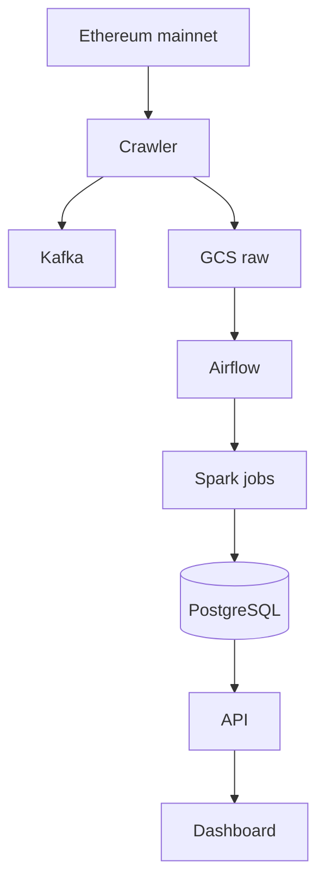
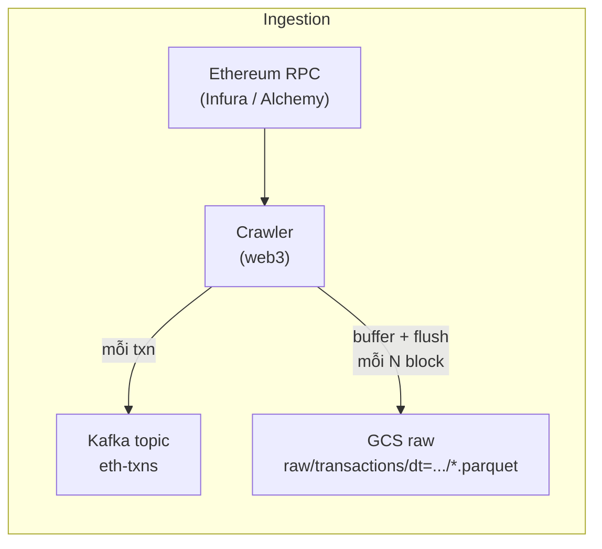
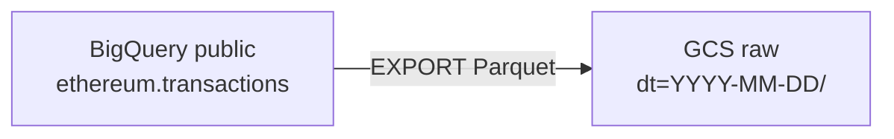
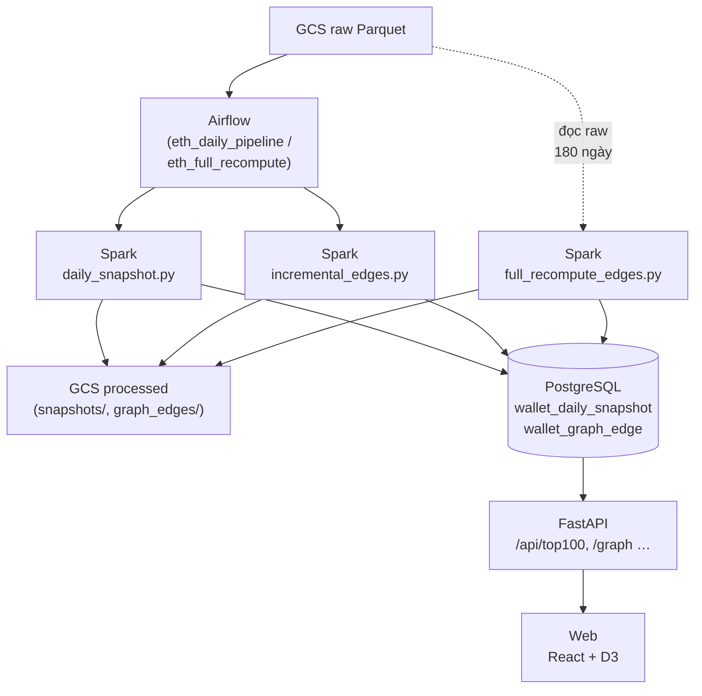

# ETH Transaction Analytics Platform (BDA501)

Big Data pipeline: crawl Ethereum transactions, store raw data in **GCS**, aggregate with **Spark** (orchestrated by **Airflow**), serve **Top 100 wallets** and a **180-day transaction graph** via **FastAPI** + **React/D3**.

**Hướng dẫn vận hành đầy đủ:** [GUIDE.md](GUIDE.md) (Docker, `.env`, GCS, Spark, troubleshooting).

---

## Kiến trúc tổng quan



---

## Luồng ingestion (live)



---

## Bootstrap lịch sử (BigQuery → GCS)



---

## Batch: Airflow, Spark, GCS processed, PostgreSQL

`daily_snapshot.py` và `incremental_edges.py` ghi **cả** Parquet processed lên GCS **và** JDBC vào PostgreSQL. `full_recompute_edges.py` thường chạy tay hoặc DAG riêng; đọc trực tiếp raw trên GCS trong cửa sổ 180 ngày.



---

## Cấu trúc repo (rút gọn)

| Thư mục | Vai trò |
| --- | --- |
| `crawler/` | Poll block, Kafka + flush Parquet raw lên GCS |
| `kafka/` | Script tạo topic (`kafka-init`) |
| `spark/` | `daily_snapshot.py`, `incremental_edges.py`, `full_recompute_edges.py`, `utils/` |
| `airflow/dags/` | `eth_daily_pipeline`, `full_recompute`, … |
| `sql/` | `init.sql`, `migrations/` |
| `api/`, `web/` | FastAPI + UI |
| `scripts/` | `setup_gcs.sh`, `smoke_test.sh`, seed test data |

Prefix GCS chuẩn: `raw/transactions/dt=…`, `processed/snapshots/dt=…`, `processed/graph_edges/run_date=…`. Biến bucket: `GCS_BUCKET` trong `.env` (mặc định `eth-bigdata-project`).

---

## Bắt đầu nhanh

1. `cp .env.example .env` và điền credential (xem [GUIDE.md](GUIDE.md)).
2. `docker compose up -d`
3. Spark / Airflow / kiểm tra dữ liệu: làm theo từng bước trong [GUIDE.md](GUIDE.md).

---

## Sau `full_recompute_edges`: làm gì để Dashboard đủ Top100 + Graph?

`full_recompute_edges` chỉ rebuild **cạnh đồ thị** (`wallet_graph_edge` + Parquet `graph_edges`). Nó **không** tạo `wallet_daily_snapshot` (Top 100 theo ngày).

1. **Xác nhận recompute thành công** — log có dạng `Full recompute complete …` / `[7/7] PostgreSQL swap finished`.
2. **Kiểm tra edges trong Postgres:**
   ```bash
   docker compose exec postgres psql -U ethuser -d ethdb -c \
     "SELECT COUNT(*), MAX(period_end) FROM wallet_graph_edge;"
   ```
3. **Chạy snapshot** cho ngày bạn muốn hiển thị trên dashboard (Top 100):
   ```bash
   docker compose exec spark-master spark-submit /app/daily_snapshot.py \
     --target-date 2025-03-31
   ```
4. **Đồng bộ graph theo ngày chạy DAG** (cửa sổ 180 ngày trượt tới `target-date`):
   ```bash
   docker compose exec spark-master spark-submit /app/incremental_edges.py \
     --target-date 2025-03-31
   ```
5. **Verify Postgres (snapshot):**
   ```bash
   docker compose exec postgres psql -U ethuser -d ethdb -c \
     "SELECT snapshot_date, COUNT(*) FROM wallet_daily_snapshot GROUP BY snapshot_date ORDER BY snapshot_date DESC LIMIT 5;"
   ```
6. **Verify API trước khi mở UI:**
   ```bash
   curl http://localhost:8000/api/health
   curl "http://localhost:8000/api/top100?date=2025-03-31&page=1&page_size=20"
   ```
7. **Mở dashboard:** Web [http://localhost:3000](http://localhost:3000) · API docs [http://localhost:8000/docs](http://localhost:8000/docs) · Airflow [http://localhost:8080](http://localhost:8080) · Spark UI [http://localhost:8082](http://localhost:8082).

**Production-style:** bật lịch DAG `eth_daily_pipeline` để mỗi ngày tự **validate → snapshot → kiểm tra → incremental edges → kiểm tra → cleanup** (không cần `spark-submit` tay cho từng ngày).

---

## Vì sao phải chạy job snapshot mới có Top 100?

Hai luồng Spark chính ghi **hai bảng** khác nhau:

| Job | Bảng / artifact chính | Ý nghĩa |
| --- | --- | --- |
| `daily_snapshot.py` | `wallet_daily_snapshot` (+ Parquet `processed/snapshots/`) | Top 100 ví **theo một ngày** (rank, volume, số giao dịch, …) — nguồn cho `/api/top100` và bảng xếp hạng UI. |
| `incremental_edges.py` | `wallet_graph_edge` (+ Parquet `processed/graph_edges/`) | Cạnh có hướng, cửa sổ **180 ngày** trượt — phục vụ graph. |
| `full_recompute_edges.py` | `wallet_graph_edge` (+ Parquet `graph_edges/`) | **Full rebuild** graph trong 180 ngày (bootstrap / recovery), **không** đụng `wallet_daily_snapshot`. |

Sau full recompute graph, **Top 100 vẫn trống** cho đến khi bạn (hoặc Airflow) chạy `daily_snapshot.py` cho ngày tương ứng.

---

## `eth_daily_pipeline` chạy để làm gì?

Định nghĩa trong [airflow/dags/daily_pipeline.py](airflow/dags/daily_pipeline.py). Lịch: **`5 0 * * *` (00:05 UTC)**.

1. **`validate_raw_partition`** — Kiểm tra trên GCS có partition raw `dt=<ngày chạy ds>` và dữ liệu hợp lệ trước khi Spark chạy.
2. **`spark_daily_snapshot`** — `spark-submit … daily_snapshot.py --target-date {{ ds }}` → cập nhật `wallet_daily_snapshot` cho đúng ngày `ds`.
3. **`check_snapshot_quality`** — Đếm dòng snapshot cho `ds` (kỳ vọng đủ ~100 hàng; có cảnh báo Slack nếu lệch).
4. **`spark_incremental_edges`** — `incremental_edges.py` cho cùng `ds` → cập nhật `wallet_graph_edge` (trượt cửa sổ, không full scan 180 ngày mỗi lần như full recompute).
5. **`check_edge_quality`** — So sánh mức thay đổi số edge so với lần trước (ngưỡng cảnh báo).
6. **`cleanup_old_partitions`** — Xóa các prefix `processed/graph_edges/run_date=…` cũ hơn 30 ngày trên GCS.

**Tóm lại:** DAG hàng ngày = tự động lặp **snapshot + incremental edges** (+ kiểm tra + dọn partition) cho mỗi ngày dữ liệu raw.

---

## Tóm tắt vai trò

- **Full recompute** — “Reset / rebuild” **graph 180 ngày** một lần (hoặc recovery).
- **Snapshot theo ngày** — Tạo **bảng xếp hạng theo ngày** cho UI Top 100.
- **`eth_daily_pipeline`** — Tự động **validate → snapshot → kiểm tra → edges → kiểm tra → cleanup** thay cho chạy tay từng lệnh.

---

## Mỗi lần crawler poll: chuyện gì xảy ra?

1. **Poll RPC** — Lấy `latest block`, so với checkpoint; với block mới gọi `get_block(..., full_transactions=True)`.
2. **Mỗi giao dịch (sau lọc)** — Trong `crawler`, thường có:
   - đẩy JSON lên Kafka topic `eth-txns`;
   - `buffer.append(txn)` để gom lô.
3. **GCS** — Sau mỗi `FLUSH_INTERVAL_BLOCKS` (ví dụ 10 block), flush buffer: gom txn theo **ngày** (timestamp → `YYYY-MM-DD`), ghi Parquet lên `gs://<bucket>/raw/transactions/dt=<ngày>/…`, cập nhật checkpoint block.

**Trong compose hiện tại:** crawler vừa là **producer Kafka** vừa **ghi thẳng raw lên GCS**; không có service riêng “Kafka consumer → GCS”. Kafka phục vụ decouple / retention / mở rộng; đường raw vào GCS là **trực tiếp từ crawler**.

---

## Dashboard lấy dữ liệu thế nào?

UI **không** đọc Kafka hay GCS.

1. **Raw** trên GCS (`raw/transactions/dt=…`) — crawler và/hoặc export BigQuery.
2. **Spark** (Airflow hoặc tay): `daily_snapshot.py` → `wallet_daily_snapshot`; `incremental_edges.py` hoặc `full_recompute_edges.py` → `wallet_graph_edge`.
3. **PostgreSQL** chỉ giữ các bảng aggregate đó.
4. **FastAPI** (`/api/top100`, graph endpoints, …) đọc Postgres.
5. **Web (React + D3)** gọi API.

Chỉ crawler chạy mà **chưa Spark** cho ngày đó → API/dashboard trống hoặc dữ liệu cũ.

---

## So sánh nhanh thành phần

| Thành phần | Vai trò trong stack thực tế |
| --- | --- |
| **Kafka** | Nhận bản sao txn realtime; hữu ích monitor / replay / mở rộng; **không** bắt buộc để có file raw trên GCS trong code hiện tại. |
| **GCS raw** | Nguồn sự thật cho batch Spark. |
| **Spark + Postgres** | Biến raw thành xếp hạng + cạnh phục vụ query. |
| **API + Dashboard** | Chỉ đọc Postgres. |

---

## Liên kết nhanh (sau `docker compose up -d`)

| Dịch vụ | URL |
| --- | --- |
| Web app | [http://localhost:3000](http://localhost:3000) |
| API (Swagger) | [http://localhost:8000/docs](http://localhost:8000/docs) |
| Airflow | [http://localhost:8080](http://localhost:8080) |
| Spark Master UI | [http://localhost:8082](http://localhost:8082) |

---

## Tài liệu thêm

- [GUIDE.md](GUIDE.md) — Cài đặt, `gsutil`/Postgres verify, Spark (zsh `'local[*]'`, backfill, retry JDBC), troubleshooting.
- [CLAUDE.md](CLAUDE.md) — Tóm tắt invariant kiến trúc cho contributor.
- [solution-design-eth-bigdata-v2.md](solution-design-eth-bigdata-v2.md) / [solution-design-eth-bigdata-v3.md](solution-design-eth-bigdata-v3.md) — Thiết kế chi tiết.
