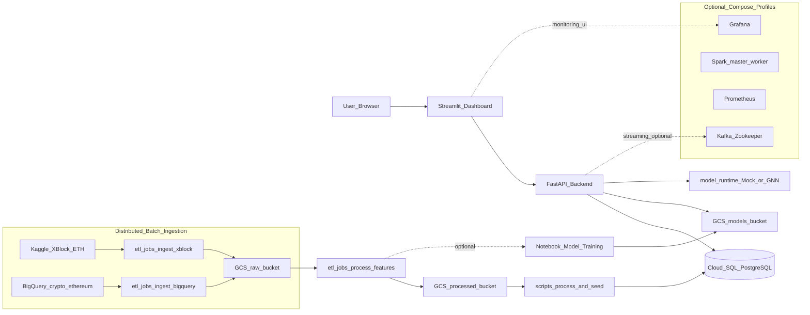

# System Architecture — Ethereum Phishing Detection Platform

This document is the **single source of truth** for the architecture of the
runnable code in this repository. It is derived from the actual code under
`api/`, `dashboard/`, `etl/jobs/`, `scripts/`, `infra/`, and
`docker-compose.yml` — not from any aspirational design.

Last updated: 2026-04-10

---

## 1) System Architecture (current state)

The platform is a **hybrid stack**: compute runs locally in Docker Compose
(API + dashboard + optional Kafka/Spark/monitoring), while all durable state
(object storage, relational DB, model artifacts) lives on **Google Cloud
Platform** (GCS + Cloud SQL PostgreSQL).

The batch ingestion step is **distributed** across two external sources —
**Kaggle** (XBlock-ETH labeled graph) and **BigQuery** (`bigquery-public-data.
crypto_ethereum`) — both of which land their raw output into the **same GCS
raw bucket** under disjoint prefixes. Feature engineering then reads *from
GCS*, not from the original sources, so the downstream path is identical
regardless of which ingest job produced the data.



### What the diagram says literally

1. **Two independent ingest jobs write to the same raw bucket.**
   - `etl/jobs/ingest_xblock.py` reads the XBlock-ETH Kaggle dataset and
     writes Parquet under `gs://$GCS_BUCKET_RAW/xblock/{transactions,labels}/`.
   - `etl/jobs/ingest_bigquery.py` queries `bigquery-public-data.crypto_ethereum.
     transactions` (bounded by `--start-date`/`--end-date` and an optional
     row `--limit`) and writes Parquet under
     `gs://$GCS_BUCKET_RAW/transactions/bigquery/year=YYYY-MM/`.
   - Neither job touches Cloud SQL directly — GCS is the only landing zone.

2. **Feature engineering is source-agnostic.**
   - `etl/jobs/process_features.py` reads raw Parquet from
     `gs://$GCS_BUCKET_RAW/…` (either the XBlock subtree, the BigQuery
     subtree, or both) and writes 12 node features + edge index + labels to
     `gs://$GCS_BUCKET_PROCESSED/features/`.

3. **Seeding Cloud SQL is a separate, explicit step.**
   - `scripts/process_and_seed.py` reads the processed parquet from GCS,
     registers a model version in Cloud SQL, and writes rows into
     `addresses`, `predictions`, and `alerts` so that the dashboard has data.
   - The API itself *does not* bulk-load Cloud SQL — it only writes
     per-prediction rows at request time via `api/database.py`.

4. **The API reads Cloud SQL + GCS models bucket; the dashboard reads the
   API.** The dashboard has no direct GCP dependency.

5. **Everything in `optional` is gated behind a Docker Compose profile**
   (`--profile full` for Spark, `--profile monitoring` for Prometheus +
   Grafana). Kafka + Zookeeper start with the default `docker compose up`,
   but the current code path does not require them for serving predictions.

---

## 2) Canonical component table

| Layer            | Component                                | Source path                                          | Status       | Notes                                                              |
|------------------|------------------------------------------|------------------------------------------------------|--------------|--------------------------------------------------------------------|
| UI               | Streamlit dashboard                      | `dashboard/`                                         | Active       | Calls FastAPI (`/health`, `/predict/*`, `/alerts`, `/dashboard/*`) |
| API              | FastAPI backend                          | `api/`                                               | Active       | Primary service for predictions, alerts, model info               |
| Model runtime    | Mock + GNN predictor + loader            | `model_runtime/`, `api/services/`                    | Mock-first   | Real GNN predictor is wired but placeholder                       |
| DB               | Cloud SQL PostgreSQL                     | `infra/postgres/init.sql`                            | Active       | Canonical schema (addresses, predictions, alerts, model_versions) |
| Object storage   | GCS — raw / processed / models           | `configs/config.yaml`, `etl/utils/gcs_utils.py`      | Active       | Three buckets; raw receives both Kaggle and BigQuery output        |
| Ingest (Kaggle)  | XBlock-ETH → GCS raw                     | `etl/jobs/ingest_xblock.py`, `scripts/ingest_xblock_pkl.py` | Active | CSV path (standard job) + pickle path (memory-constrained helper)  |
| Ingest (BigQuery)| `crypto_ethereum` → GCS raw              | `etl/jobs/ingest_bigquery.py`                        | Active       | Bounded by date range + row limit; dry-run estimates cost          |
| Feature eng.     | GCS raw → GCS processed (12 features)    | `etl/jobs/process_features.py`                       | Active       | Consumes from whichever prefix(es) are present                     |
| Seed             | GCS processed → Cloud SQL                | `scripts/process_and_seed.py`                        | Active       | Writes addresses/predictions/alerts + registers model version      |
| Export           | Cloud SQL + GCS batch predictions        | `etl/jobs/export_predictions.py`                     | Active       | Batch predictions into features table + Cloud SQL                  |
| Orchestrator     | ETL runner                               | `scripts/run_etl.py`, `etl/run_pipeline.py`          | Active       | `--source {xblock,bigquery,process,all}` with `--dry-run`          |
| Messaging        | Kafka + Zookeeper                        | `docker-compose.yml`, `infra/kafka/create-topics.sh` | Optional     | Starts by default but no request path depends on it yet           |
| Spark            | Spark master/worker                      | compose profile `full`                               | Optional     | Not required for base API/dashboard                               |
| Monitoring       | Prometheus + Grafana                     | compose profile `monitoring`                         | Optional     | Ops visibility only                                               |

Anything **not** in this table is either legacy (`pipeline/`) or a helper
script and must not be treated as load-bearing.

---

## 3) Data flow (Parquet paths, verbatim)

```
Kaggle  ──► etl/jobs/ingest_xblock.py   ──► gs://$RAW/xblock/transactions/transactions.parquet
                                            gs://$RAW/xblock/labels/labels.parquet
                                            gs://$RAW/xblock/_manifest.json

BigQuery ──► etl/jobs/ingest_bigquery.py ──► gs://$RAW/transactions/bigquery/year=YYYY-MM/*.parquet
                                            (optional) gs://$RAW/transfers/bigquery/year=YYYY-MM/*.parquet

                  etl/jobs/process_features.py (reads raw Parquet from GCS)
                          │
                          ▼
                  gs://$PROCESSED/features/node_features.parquet
                  gs://$PROCESSED/features/edge_index.parquet
                  gs://$PROCESSED/features/labels.parquet
                  gs://$PROCESSED/features/_summary.json

                  scripts/process_and_seed.py
                          │
                          ▼
                  Cloud SQL: addresses, predictions, alerts, model_versions, model_metrics
                  gs://$MODELS/models/current/metadata.json
```

---

## 4) What is deliberately excluded from the diagram

The following items appeared in earlier drafts of the architecture and have
been removed because they do **not** match the runnable code:

- A `minimal` Docker Compose profile. There is no `profiles: [minimal]`
  anywhere in `docker-compose.yml`; `api` and `dashboard` run on the default
  `docker compose up`. Any "minimal stack" command in older docs should be
  ignored.
- A "MinIO / local S3" object store. GCS is the only object store — all ETL
  jobs import `etl/utils/gcs_utils.py` and the API reads models from
  `gs://$GCS_BUCKET_MODELS`.
- A "local Postgres" service inside Compose. The root `docker-compose.yml`
  does **not** define a Postgres service; Cloud SQL is the only database.
  (The legacy `pipeline/docker-compose.yml` does define one, but `pipeline/`
  is explicitly reference-only.)
- Direct writes from `api/` into the `addresses` table. The API only
  appends per-request rows into `predictions` and (conditionally) `alerts`;
  the `addresses` table is populated by `scripts/process_and_seed.py`.
- References to `PLATFORM_DESIGN.md`, `RUN_GUIDE.md`,
  `implementation_plan.md`, or `gnn_ethereum_phishing_detection.md`. None of
  those files exist in this repo.

If a future document claims any of the above, it is stale.

---

## 5) Conventions

- One schema contract: `infra/postgres/init.sql`.
- One topic naming convention (if Kafka is enabled): `eth.transactions`,
  `eth.alerts`, `eth.dead-letter`.
- One source of architecture truth: this file.
- `pipeline/` is migration source, not runtime truth.
