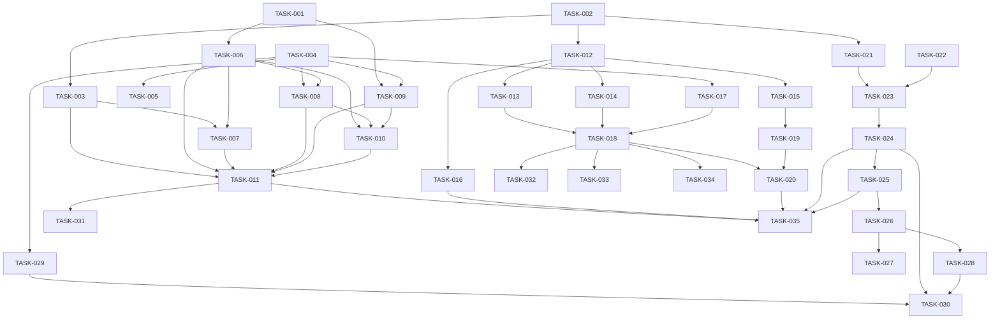

# Implementation Plan: ETH Transaction Analytics Platform

> **For agentic workers:** Use subagent-driven-development (recommended) or executing-plans to implement this plan task-by-task. Steps use checkbox (`- [ ]`) syntax for tracking.

**Ticket:** BDA501-FINAL | **Date:** 2026-04-10 | **Status:** Complete

**Goal:** Build a full ETH transaction analytics pipeline that crawls blockchain data, computes daily top-100 wallet rankings, builds a 180-day transaction graph, and serves interactive visualizations.

**Architecture:** Lambda-style 4-layer pipeline. Crawler ingests ETH blocks via JSON-RPC → publishes to Kafka → flushes Parquet to GCS (source of truth). Airflow triggers daily Spark batch jobs that compute wallet snapshots and incremental edge aggregations, writing results to PostgreSQL. FastAPI serves the data; React + D3.js renders a top-100 table and force-directed wallet graph.

---

## File Structure

| File | Action | Responsibility |
|------|--------|---------------|
| `docker-compose.yml` | Create | Orchestrate all services (Kafka, PostgreSQL, Spark, Airflow, API, Web) |
| `.env.example` | Create | Document all required environment variables |
| `.gitignore` | Create | Ignore .env, Parquet, checkpoints, node_modules, __pycache__ |
| `sql/init.sql` | Create | PostgreSQL schema: wallet_daily_snapshot, wallet_graph_edge, staging table |
| `scripts/setup_gcs.sh` | Create | Create GCS bucket and folder structure with lifecycle policies |
| `bigquery/bootstrap_export.sql` | Create | BigQuery → GCS Parquet export query for historical data |
| `bigquery/verify_export.sql` | Create | Verification queries for exported data |
| `crawler/Dockerfile` | Create | Python 3.11 image for crawler |
| `crawler/requirements.txt` | Create | web3, kafka-python, google-cloud-storage, pyarrow, python-dotenv |
| `crawler/main.py` | Create | Crawler main loop: startup → gap detect → backfill → live poll |
| `crawler/eth_client.py` | Create | web3.py wrapper: get blocks + parse transactions |
| `crawler/kafka_producer.py` | Create | Kafka producer: schema validate + publish per txn |
| `crawler/gcs_writer.py` | Create | Buffer + flush Parquet to GCS raw zone |
| `crawler/checkpoint.py` | Create | Persist last_processed_block to local + GCS |
| `crawler/gap_detector.py` | Create | Scan GCS partitions for missing block ranges |
| `spark/Dockerfile` | Create | Spark image with GCS connector + PG JDBC driver |
| `spark/requirements.txt` | Create | pyspark, google-cloud-storage, psycopg2-binary |
| `spark/daily_snapshot.py` | Create | Job 1: aggregate per-wallet stats, rank top 100 |
| `spark/incremental_edges.py` | Create | Job 2: sliding window edge aggregation (prev + enter - exit) |
| `spark/full_recompute_edges.py` | Create | Fallback: full 180-day edge recompute from raw |
| `spark/utils/gcs_io.py` | Create | Spark ↔ GCS read/write helpers |
| `spark/utils/pg_writer.py` | Create | Spark → PostgreSQL JDBC upsert + atomic swap |
| `airflow/Dockerfile` | Create | Airflow image with Google + Spark providers |
| `airflow/dags/daily_pipeline.py` | Create | DAG: validate → snapshot → edges → cleanup (00:05 UTC) |
| `airflow/dags/full_recompute.py` | Create | DAG: manual-trigger full edge recompute |
| `airflow/plugins/validators.py` | Create | GCS partition existence + row count validation |
| `api/Dockerfile` | Create | Python 3.11 image for FastAPI |
| `api/requirements.txt` | Create | fastapi, uvicorn, asyncpg, slowapi, pydantic |
| `api/main.py` | Create | FastAPI app: CORS, rate limiting, DB pool lifecycle |
| `api/routes/top100.py` | Create | GET /api/top100 — paginated daily snapshot |
| `api/routes/wallet_graph.py` | Create | GET /api/wallet/{address}/graph — edges + nodes |
| `api/routes/health.py` | Create | GET /api/health — last snapshot date + status |
| `api/db/connection.py` | Create | Async PostgreSQL connection pool |
| `api/db/models.py` | Create | Query helpers for snapshot + edge tables |
| `api/schemas/responses.py` | Create | Pydantic response models |
| `web/package.json` | Create | React + D3.js + react-router-dom dependencies |
| `web/vite.config.js` | Create | Vite config with API proxy |
| `web/Dockerfile` | Create | Multi-stage: Node build → nginx static serve |
| `web/src/App.jsx` | Create | Router: / → Table, /wallet/:address → Graph |
| `web/src/components/Top100Table.jsx` | Create | Sortable paginated table with row click navigation |
| `web/src/components/WalletGraph.jsx` | Create | D3 forceSimulation graph with zoom/drag/tooltips |
| `web/src/components/DatePicker.jsx` | Create | Date selector defaulting to latest snapshot |
| `web/src/hooks/useApi.js` | Create | Data fetching hooks with loading/error states |
| `web/src/utils/graphLayout.js` | Create | API response → D3 node/link format + log-scale widths |
| `scripts/seed_test_data.py` | Create | Generate synthetic Parquet test data in GCS |
| `scripts/smoke_test.sh` | Create | End-to-end pipeline verification script |

---

## Tasks

### TASK-001: Project Scaffolding ✅
- **Files:** `.env.example`, `.gitignore`
- **Dependencies:** none
- **Complexity:** S

- [x] **Step 1: Create `.env.example`**
    ```bash
    # Ethereum RPC
    INFURA_PROJECT_ID=your_infura_project_id
    ETH_RPC_URL=https://mainnet.infura.io/v3/${INFURA_PROJECT_ID}

    # Kafka
    KAFKA_BOOTSTRAP_SERVERS=kafka:9092
    KAFKA_TOPIC=eth-txns

    # Google Cloud Storage
    GCS_BUCKET=eth-bigdata-project
    GCS_PROJECT_ID=your_gcp_project_id
    GOOGLE_APPLICATION_CREDENTIALS=/app/credentials/gcs-key.json

    # PostgreSQL
    POSTGRES_HOST=postgres
    POSTGRES_PORT=5432
    POSTGRES_DB=ethdb
    POSTGRES_USER=ethuser
    POSTGRES_PASSWORD=ethpass

    # Airflow
    AIRFLOW__CORE__FERNET_KEY=your_fernet_key
    AIRFLOW__CORE__EXECUTOR=LocalExecutor

    # Alerting
    SLACK_WEBHOOK_URL=https://hooks.slack.com/services/XXX/YYY/ZZZ
    ```
- [x] **Step 2: Create `.gitignore`**
    ```
    .env
    *.parquet
    __pycache__/
    *.pyc
    node_modules/
    dist/
    build/
    checkpoints/
    *.egg-info/
    .venv/
    credentials/
    ```
- [x] **Step 3: Create directory structure**
    Run: `mkdir -p crawler spark/utils airflow/dags airflow/plugins api/routes api/db api/schemas web/src/components web/src/hooks web/src/utils web/public sql bigquery scripts config`
- [ ] **Step 4: Commit**
    `git add .env.example .gitignore && git commit -m "chore: initial project scaffolding"`

---

### TASK-002: PostgreSQL Schema ✅
- **Files:** `sql/init.sql`
- **Dependencies:** none
- **Complexity:** S

- [x] **Step 1: Write schema DDL**
    ```sql
    -- wallet_daily_snapshot: one row per wallet per day (top 100)
    CREATE TABLE IF NOT EXISTS wallet_daily_snapshot (
        id              SERIAL PRIMARY KEY,
        wallet_address  VARCHAR(42) NOT NULL,
        snapshot_date   DATE NOT NULL,
        rank            INT NOT NULL,
        total_volume    NUMERIC(38,18) NOT NULL,
        total_txns      BIGINT NOT NULL,
        sent_eth        NUMERIC(38,18) NOT NULL,
        recv_eth        NUMERIC(38,18) NOT NULL,
        sent_count      BIGINT NOT NULL,
        recv_count      BIGINT NOT NULL,
        created_at      TIMESTAMP DEFAULT NOW()
    );

    CREATE UNIQUE INDEX IF NOT EXISTS idx_snapshot_wallet_date
        ON wallet_daily_snapshot (wallet_address, snapshot_date);
    CREATE INDEX IF NOT EXISTS idx_snapshot_date_rank
        ON wallet_daily_snapshot (snapshot_date, rank);

    -- wallet_graph_edge: one row per directed wallet pair (180-day rolling window)
    CREATE TABLE IF NOT EXISTS wallet_graph_edge (
        id              SERIAL PRIMARY KEY,
        from_wallet     VARCHAR(42) NOT NULL,
        to_wallet       VARCHAR(42) NOT NULL,
        total_volume    NUMERIC(38,18) NOT NULL,
        tx_count        BIGINT NOT NULL,
        period_start    DATE NOT NULL,
        period_end      DATE NOT NULL,
        updated_at      TIMESTAMP DEFAULT NOW()
    );

    CREATE UNIQUE INDEX IF NOT EXISTS idx_edge_pair
        ON wallet_graph_edge (from_wallet, to_wallet);
    CREATE INDEX IF NOT EXISTS idx_edge_from
        ON wallet_graph_edge (from_wallet);
    CREATE INDEX IF NOT EXISTS idx_edge_to
        ON wallet_graph_edge (to_wallet);

    -- Staging table for atomic swap (identical schema, no indexes needed)
    CREATE TABLE IF NOT EXISTS wallet_graph_edge_staging (
        id              SERIAL PRIMARY KEY,
        from_wallet     VARCHAR(42) NOT NULL,
        to_wallet       VARCHAR(42) NOT NULL,
        total_volume    NUMERIC(38,18) NOT NULL,
        tx_count        BIGINT NOT NULL,
        period_start    DATE NOT NULL,
        period_end      DATE NOT NULL,
        updated_at      TIMESTAMP DEFAULT NOW()
    );
    ```
- [ ] **Step 2: Verify syntax** (requires Docker — deferred to TASK-003)
    Run: `docker compose exec postgres psql -U ethuser -d ethdb -f /docker-entrypoint-initdb.d/init.sql`
    Expected: tables created with correct columns and indexes
- [ ] **Step 3: Commit**
    `git add sql/init.sql && git commit -m "feat: PostgreSQL schema for snapshot and graph tables"`

---

### TASK-003: Docker Compose — Core Infrastructure ✅
- **Files:** `docker-compose.yml`, `kafka/create-topics.sh`
- **Dependencies:** TASK-002
- **Complexity:** M

- [x] **Step 1: Write `kafka/create-topics.sh`**
    ```bash
    #!/bin/bash
    kafka-topics.sh --create --if-not-exists \
      --bootstrap-server localhost:9092 \
      --topic eth-txns \
      --partitions 6 \
      --replication-factor 1
    ```
- [x] **Step 2: Write `docker-compose.yml` with core services**
    Services to define:
    - `zookeeper` — Confluent CP 7.5, port 2181
    - `kafka` — Confluent CP 7.5, port 9092, depends on zookeeper, auto-create topic via entrypoint
    - `postgres` — PostgreSQL 15, port 5432, mount `sql/init.sql` to `/docker-entrypoint-initdb.d/`, env from `.env`
    - Network: `eth-net` (bridge)
    - Volumes: `postgres-data` for persistence
- [ ] **Step 3: Boot and verify**
    Run: `docker compose up -d && docker compose ps`
    Expected: All services healthy
    Run: `docker compose exec kafka kafka-topics.sh --list --bootstrap-server localhost:9092`
    Expected: `eth-txns` topic listed
    Run: `docker compose exec postgres psql -U ethuser -d ethdb -c '\dt'`
    Expected: `wallet_daily_snapshot`, `wallet_graph_edge`, `wallet_graph_edge_staging` listed
- [ ] **Step 4: Commit**
    `git add docker-compose.yml kafka/ && git commit -m "feat: Docker Compose with Kafka + PostgreSQL"`

---

### TASK-004: GCS Bucket Setup ✅
- **Files:** `scripts/setup_gcs.sh`
- **Dependencies:** none
- **Complexity:** S

- [x] **Step 1: Write setup script**
    ```bash
    #!/bin/bash
    set -euo pipefail
    BUCKET="${GCS_BUCKET:-eth-bigdata-project}"
    PROJECT="${GCS_PROJECT_ID:?Must set GCS_PROJECT_ID}"

    # Create bucket
    gsutil mb -p "$PROJECT" -l US "gs://$BUCKET/" 2>/dev/null || echo "Bucket exists"

    # Create folder markers
    for prefix in raw/transactions/ processed/snapshots/ processed/graph_edges/ \
                  checkpoints/ingest/ checkpoints/spark/ archive/transactions/; do
        gsutil cp /dev/null "gs://$BUCKET/$prefix"
    done

    # Lifecycle: raw → Nearline after 12 months, delete after 36 months
    cat > /tmp/lifecycle.json <<'EOF'
    {
      "rule": [
        {"action": {"type": "SetStorageClass", "storageClass": "NEARLINE"},
         "condition": {"age": 365, "matchesPrefix": ["raw/"]}},
        {"action": {"type": "Delete"},
         "condition": {"age": 1095, "matchesPrefix": ["raw/"]}}
      ]
    }
    EOF
    gsutil lifecycle set /tmp/lifecycle.json "gs://$BUCKET/"
    echo "GCS bucket setup complete: gs://$BUCKET/"
    ```
- [ ] **Step 2: Run and verify**
    Run: `bash scripts/setup_gcs.sh`
    Run: `gsutil ls gs://eth-bigdata-project/`
    Expected: all prefixes listed
- [ ] **Step 3: Commit**
    `git add scripts/setup_gcs.sh && git commit -m "feat: GCS bucket setup script with lifecycle policies"`

---

### TASK-005: BigQuery Historical Bootstrap ✅
- **Files:** `bigquery/bootstrap_export.sql`, `bigquery/verify_export.sql`
- **Dependencies:** TASK-004
- **Complexity:** S

- [x] **Step 1: Write export query**
    ```sql
    -- bigquery/bootstrap_export.sql
    -- Run in BigQuery console or via: bq query --use_legacy_sql=false < bigquery/bootstrap_export.sql
    EXPORT DATA OPTIONS (
      uri = 'gs://eth-bigdata-project/raw/transactions/dt=*/part-*.parquet',
      format = 'PARQUET',
      overwrite = true
    ) AS
    SELECT
      transaction_hash  AS tx_hash,
      block_number,
      block_timestamp   AS timestamp,
      from_address      AS `from`,
      to_address        AS `to`,
      CAST(value AS NUMERIC) / 1000000000000000000  AS value_eth,
      gas,
      gas_price
    FROM `bigquery-public-data.crypto_ethereum.transactions`
    WHERE block_timestamp >= TIMESTAMP('2024-10-01')
      AND block_timestamp <  TIMESTAMP('2025-04-01');
    ```
- [x] **Step 2: Write verification query**
    ```sql
    -- bigquery/verify_export.sql
    -- Compare row counts per date between BigQuery and GCS
    SELECT
      DATE(block_timestamp) AS dt,
      COUNT(*) AS row_count
    FROM `bigquery-public-data.crypto_ethereum.transactions`
    WHERE block_timestamp >= TIMESTAMP('2024-10-01')
      AND block_timestamp <  TIMESTAMP('2025-04-01')
    GROUP BY dt
    ORDER BY dt;
    ```
- [ ] **Step 3: Execute export and spot-check**
    Run export in BigQuery console.
    Run: `gsutil ls gs://eth-bigdata-project/raw/transactions/ | head -20`
    Expected: `dt=YYYY-MM-DD/` folders with Parquet files
- [ ] **Step 4: Commit**
    `git add bigquery/ && git commit -m "feat: BigQuery bootstrap export + verification queries"`

---

### TASK-006: ETH RPC Client ✅
- **Files:** `crawler/eth_client.py`, `crawler/requirements.txt`
- **Dependencies:** TASK-001
- **Complexity:** M

- [x] **Step 1: Write `crawler/requirements.txt`**
    ```
    web3>=6.0,<7.0
    kafka-python>=2.0,<3.0
    google-cloud-storage>=2.0,<3.0
    pyarrow>=14.0,<16.0
    python-dotenv>=1.0,<2.0
    ```
- [x] **Step 2: Write `crawler/eth_client.py`**
    - Class `EthClient(rpc_url: str)`
    - Uses `web3.Web3(web3.HTTPProvider(rpc_url))`
    - Method `get_latest_block_number() → int`
    - Method `get_block_transactions(block_number: int) → list[dict]`
      - Calls `w3.eth.get_block(block_number, full_transactions=True)`
      - For each tx: extract `tx_hash` (hex), `block_number`, `timestamp` (from block), `from`, `to`, `value_eth` (Wei → ETH via `Decimal(value) / Decimal(10**18)`), `gas`, `gas_price`
      - Skip contract creation txns where `to` is None
    - Retry decorator: 3 attempts, exponential backoff (1s, 2s, 4s) on `web3.exceptions`
- [ ] **Step 3: Test manually**
    Run: `python -c "from eth_client import EthClient; c = EthClient('https://mainnet.infura.io/v3/YOUR_KEY'); print(c.get_latest_block_number())"`
    Expected: returns current block number
- [ ] **Step 4: Commit**
    `git add crawler/eth_client.py crawler/requirements.txt && git commit -m "feat: ETH RPC client with transaction parsing"`

---

### TASK-007: Kafka Producer ✅
- **Files:** `crawler/kafka_producer.py`
- **Dependencies:** TASK-003, TASK-006
- **Complexity:** S

- [x] **Step 1: Write `crawler/kafka_producer.py`**
    - Class `TxnProducer(bootstrap_servers: str, topic: str)`
    - Uses `kafka.KafkaProducer` with JSON value serializer
    - Required fields schema: `{tx_hash, block_number, timestamp, from, to, value_eth, gas, gas_price}`
    - Method `publish(txn: dict)` — validate schema → serialize → send with key=`tx_hash.encode()`
    - Method `flush()` — call `producer.flush()`
    - Method `close()` — flush + close producer
- [ ] **Step 2: Integration test**
    Run crawler briefly, then:
    Run: `docker compose exec kafka kafka-console-consumer.sh --bootstrap-server localhost:9092 --topic eth-txns --from-beginning --max-messages 3`
    Expected: 3 JSON transaction messages printed
- [ ] **Step 3: Commit**
    `git add crawler/kafka_producer.py && git commit -m "feat: Kafka producer with schema validation"`

---

### TASK-008: GCS Parquet Writer ✅
- **Files:** `crawler/gcs_writer.py`
- **Dependencies:** TASK-004, TASK-006
- **Complexity:** M

- [x] **Step 1: Write `crawler/gcs_writer.py`**
    - Class `GcsParquetWriter(bucket_name: str, prefix: str = "raw/transactions")`
    - Uses `google.cloud.storage.Client` + `pyarrow`
    - Parquet schema: `tx_hash UTF8`, `block_number INT64`, `timestamp TIMESTAMP[ms]`, `from UTF8`, `to UTF8`, `value_eth DECIMAL128(38,18)`, `gas INT64`, `gas_price INT64`
    - Method `flush(transactions: list[dict], date_str: str)`:
      - Convert list to `pyarrow.Table`
      - Write to `gs://{bucket}/{prefix}/dt={date_str}/part-{unix_ts}-{seq}.parquet` using Snappy compression
      - Return number of rows written
    - Handles empty transaction lists gracefully (no-op)
- [ ] **Step 2: Test**
    Run: write 10 fake transactions, then `gsutil ls gs://eth-bigdata-project/raw/transactions/dt=test/`
    Expected: Parquet file listed
    Cleanup: `gsutil rm -r gs://eth-bigdata-project/raw/transactions/dt=test/`
- [ ] **Step 3: Commit**
    `git add crawler/gcs_writer.py && git commit -m "feat: GCS Parquet writer with Snappy compression"`

---

### TASK-009: Checkpoint Manager ✅
- **Files:** `crawler/checkpoint.py`
- **Dependencies:** TASK-004
- **Complexity:** S

- [x] **Step 1: Write `crawler/checkpoint.py`**
    - Class `CheckpointManager(local_path: str, gcs_bucket: str, gcs_key: str = "checkpoints/ingest/last_block.txt")`
    - Method `save(block_number: int)` — write to local file + upload to GCS
    - Method `load() → int` — read local first, fall back to GCS, fall back to 0
    - All operations use string representation of the integer
- [ ] **Step 2: Test round-trip**
    Run: `save(12345)` then `load()` — returns 12345
    Run: delete local file, `load()` — returns 12345 from GCS
- [ ] **Step 3: Commit**
    `git add crawler/checkpoint.py && git commit -m "feat: checkpoint manager with local + GCS fallback"`

---

### TASK-010: Gap Detector ✅
- **Files:** `crawler/gap_detector.py`
- **Dependencies:** TASK-008, TASK-009
- **Complexity:** M

- [x] **Step 1: Write `crawler/gap_detector.py`**
    - Class `GapDetector(gcs_bucket: str, prefix: str = "raw/transactions")`
    - Method `detect_gaps(checkpoint_block: int, chain_head: int) → list[tuple[int, int]]`:
      - List all GCS partitions under prefix
      - For each partition, read Parquet metadata to extract min/max `block_number`
      - Build a set of all covered block numbers
      - Find contiguous missing ranges between `checkpoint_block` and `chain_head`
      - Return list of `(start_block, end_block)` gaps
    - Optimization: only scan partitions for recent dates (last 7 days) to avoid scanning entire history
- [ ] **Step 2: Test with known gap**
    Manually delete one partition's Parquet file → run detector → verify gap returned
- [ ] **Step 3: Commit**
    `git add crawler/gap_detector.py && git commit -m "feat: gap detector scans GCS for missing block ranges"`

---

### TASK-011: Crawler Main Loop ✅
- **Files:** `crawler/main.py`, `crawler/Dockerfile`
- **Dependencies:** TASK-006, TASK-007, TASK-008, TASK-009, TASK-010
- **Complexity:** L

- [x] **Step 1: Write `crawler/main.py`**
    - Load config from environment (`.env`)
    - Initialize: `EthClient`, `TxnProducer`, `GcsParquetWriter`, `CheckpointManager`, `GapDetector`
    - Startup sequence:
      1. `checkpoint = CheckpointManager.load()`
      2. `chain_head = EthClient.get_latest_block_number()`
      3. `gaps = GapDetector.detect_gaps(checkpoint, chain_head)`
      4. For each gap: fetch blocks, publish to Kafka, buffer for GCS
      5. Enter live polling loop
    - Live loop:
      1. `latest = EthClient.get_latest_block_number()`
      2. For each new block from `checkpoint+1` to `latest`:
         - `txns = EthClient.get_block_transactions(block)`
         - For each txn: `TxnProducer.publish(txn)`, add to buffer
      3. Every 10 blocks: `GcsParquetWriter.flush(buffer)`, `CheckpointManager.save(block)`
      4. If no new blocks: sleep 2 seconds
    - Signal handler: SIGTERM/SIGINT → flush remaining buffer → save checkpoint → exit
    - Health endpoint: `/healthz` on port 8001 (simple `http.server` in thread)
- [x] **Step 2: Write `crawler/Dockerfile`**
    ```dockerfile
    FROM python:3.11-slim
    WORKDIR /app
    COPY requirements.txt .
    RUN pip install --no-cache-dir -r requirements.txt
    COPY . .
    CMD ["python", "main.py"]
    ```
- [x] **Step 3: Add crawler to `docker-compose.yml`**
    - Service `crawler`: build `./crawler`, depends on `kafka` + `postgres`, `restart: always`
    - Env from `.env`, mount GCS credentials volume
    - Healthcheck: `curl -f http://localhost:8001/healthz`
- [ ] **Step 4: Run and verify**
    Run: `docker compose up crawler -d && docker compose logs -f crawler`
    Expected: logs show blocks being processed, Kafka messages produced, GCS flushes
    Run: `curl http://localhost:8001/healthz`
    Expected: `{"last_block": N, "chain_head": M, "lag": M-N, "status": "ok"}`
- [ ] **Step 5: Commit**
    `git add crawler/ docker-compose.yml && git commit -m "feat: crawler main loop with gap detection and health endpoint"`

---

### TASK-012: Spark Utilities ✅
- **Files:** `spark/utils/__init__.py`, `spark/utils/gcs_io.py`, `spark/utils/pg_writer.py`, `spark/requirements.txt`
- **Dependencies:** TASK-002, TASK-004
- **Complexity:** M

- [x] **Step 1: Write `spark/requirements.txt`**
    ```
    pyspark>=3.5,<4.0
    google-cloud-storage>=2.0,<3.0
    psycopg2-binary>=2.9,<3.0
    ```
- [x] **Step 2: Write `spark/utils/gcs_io.py`**
    - Function `create_spark_session(app_name: str) → SparkSession`:
      - Configure `spark.jars` with GCS connector JAR path
      - Set `fs.gs.impl` and `fs.gs.project.id` and credential path
    - Function `read_raw_partition(spark, bucket, date_str) → DataFrame`:
      - Read `gs://{bucket}/raw/transactions/dt={date_str}/`
    - Function `write_parquet(df, bucket, path, mode="overwrite")`:
      - Write DataFrame as Parquet to GCS
- [x] **Step 3: Write `spark/utils/pg_writer.py`**
    - JDBC URL construction from env vars
    - Function `upsert_snapshot(df, jdbc_url, properties)`:
      - Write to `wallet_daily_snapshot` with mode `append`
      - Handle conflict via temp table + INSERT ... ON CONFLICT DO UPDATE
    - Function `atomic_swap_edges(df, jdbc_url, properties)`:
      - Truncate `wallet_graph_edge_staging`
      - Write df to `wallet_graph_edge_staging`
      - Execute swap:
        ```sql
        BEGIN;
        ALTER TABLE wallet_graph_edge RENAME TO wallet_graph_edge_old;
        ALTER TABLE wallet_graph_edge_staging RENAME TO wallet_graph_edge;
        DROP TABLE wallet_graph_edge_old;
        COMMIT;
        ```
      - Recreate `wallet_graph_edge_staging` (empty copy of new `wallet_graph_edge`)
- [ ] **Step 4: Commit**
    `git add spark/ && git commit -m "feat: Spark GCS I/O and PostgreSQL writer utilities"`

---

### TASK-013: Spark Job 1 — Daily Snapshot ✅
- **Files:** `spark/daily_snapshot.py`
- **Dependencies:** TASK-012
- **Complexity:** L

- [x] **Step 1: Write `spark/daily_snapshot.py`**
    - Argument: `--target-date YYYY-MM-DD`
    - Create Spark session via `create_spark_session("daily_snapshot")`
    - Read raw partition for `target_date`
    - Compute sent stats: `GROUP BY from → SUM(value_eth) AS sent_eth, COUNT(*) AS sent_count`
    - Compute recv stats: `GROUP BY to → SUM(value_eth) AS recv_eth, COUNT(*) AS recv_count`
    - Full outer join on wallet address, coalesce nulls to 0
    - Compute `total_volume = sent_eth + recv_eth`, `total_txns = sent_count + recv_count`
    - Apply `DENSE_RANK() OVER (ORDER BY total_txns DESC)` via `Window` function
    - Filter `rank <= 100`
    - Add `snapshot_date` and `created_at` columns
    - Write to GCS: `processed/snapshots/dt={target_date}/`
    - Write to PostgreSQL: `wallet_daily_snapshot` via upsert
- [ ] **Step 2: Test against bootstrapped data**
    Run: `spark-submit spark/daily_snapshot.py --target-date 2025-01-15`
    Run: `psql -c "SELECT rank, wallet_address, total_txns, total_volume FROM wallet_daily_snapshot WHERE snapshot_date='2025-01-15' ORDER BY rank LIMIT 5"`
    Expected: 100 rows ranked by total_txns descending
- [ ] **Step 3: Commit**
    `git add spark/daily_snapshot.py && git commit -m "feat: Spark daily snapshot job — top 100 wallets by txn count"`

---

### TASK-014: Spark Job 2 — Incremental Edge Aggregation ✅
- **Files:** `spark/incremental_edges.py`
- **Dependencies:** TASK-012
- **Complexity:** L

- [x] **Step 1: Write `spark/incremental_edges.py`**
    - Argument: `--target-date YYYY-MM-DD`
    - Step 1: Attempt to read previous edge aggregate from `processed/graph_edges/run_date={target_date - 1 day}/`
      - If not found (first run): use empty DataFrame with schema `(from_wallet, to_wallet, total_volume, tx_count)`
    - Step 2: Read raw data for `target_date` → aggregate `(from, to)` → `SUM(value_eth) AS volume_entering`, `COUNT(*) AS count_entering`
    - Step 3: Calculate exit date = `target_date - 180 days`
      - Read raw data for exit date (if partition exists) → same aggregation as entering
      - If partition doesn't exist: treat as empty
    - Step 4: Merge —
      ```python
      new = prev
          .join(entering, on=[from_wallet, to_wallet], how="full_outer")
          .join(exiting,  on=[from_wallet, to_wallet], how="full_outer")
      new.total_volume = coalesce(prev.vol, 0) + coalesce(entering.vol, 0) - coalesce(exiting.vol, 0)
      new.tx_count     = coalesce(prev.cnt, 0) + coalesce(entering.cnt, 0) - coalesce(exiting.cnt, 0)
      ```
    - Step 5: Filter `tx_count > 0`
    - Step 6: Set `period_start = target_date - 179 days`, `period_end = target_date`
    - Step 7: Write to GCS: `processed/graph_edges/run_date={target_date}/`
    - Step 8: Write to PostgreSQL via `atomic_swap_edges()`
- [ ] **Step 2: Test**
    Run: `spark-submit spark/incremental_edges.py --target-date 2025-01-15`
    Run: `psql -c "SELECT from_wallet, to_wallet, total_volume, tx_count FROM wallet_graph_edge LIMIT 5"`
    Expected: directed edge rows with positive volumes
- [ ] **Step 3: Commit**
    `git add spark/incremental_edges.py && git commit -m "feat: Spark incremental edge aggregation — 180-day sliding window"`

---

### TASK-015: Spark Job 3 — Full Recompute ✅
- **Files:** `spark/full_recompute_edges.py`
- **Dependencies:** TASK-012
- **Complexity:** M

- [x] **Step 1: Write `spark/full_recompute_edges.py`**
    - Argument: `--end-date YYYY-MM-DD`
    - Compute `start_date = end_date - 179 days`
    - Read all raw partitions from `dt=start_date` through `dt=end_date`
    - Aggregate all `(from, to)` pairs → `SUM(value_eth)`, `COUNT(*)`
    - Set `period_start`, `period_end`
    - Write to GCS: `processed/graph_edges/run_date={end_date}/`
    - Write to PostgreSQL via `atomic_swap_edges()`
- [ ] **Step 2: Test and compare with incremental**
    Run on same date as TASK-014 test → compare row counts
    Expected: identical or near-identical results
- [ ] **Step 3: Commit**
    `git add spark/full_recompute_edges.py && git commit -m "feat: Spark full 180-day edge recompute for bootstrap/recovery"`

---

### TASK-016: Spark Dockerfile ✅
- **Files:** `spark/Dockerfile`
- **Dependencies:** TASK-012
- **Complexity:** S

- [x] **Step 1: Write `spark/Dockerfile`**
    ```dockerfile
    FROM bitnami/spark:3.5
    USER root
    # GCS connector + PostgreSQL JDBC driver
    RUN curl -o /opt/bitnami/spark/jars/gcs-connector-hadoop3-latest.jar \
        https://storage.googleapis.com/hadoop-lib/gcs/gcs-connector-hadoop3-latest.jar && \
        curl -o /opt/bitnami/spark/jars/postgresql-42.7.1.jar \
        https://jdbc.postgresql.org/download/postgresql-42.7.1.jar
    COPY requirements.txt /app/
    RUN pip install --no-cache-dir -r /app/requirements.txt
    COPY . /app/
    WORKDIR /app
    USER 1001
    ```
- [x] **Step 2: Add Spark services to `docker-compose.yml`**
    - `spark-master`: port 7077 (master), 8082 (web UI)
    - `spark-worker`: depends on `spark-master`, connects to master
- [ ] **Step 3: Verify**
    Run: `docker compose up spark-master spark-worker -d`
    Open: `http://localhost:8082` — Spark master UI shows worker registered
- [ ] **Step 4: Commit**
    `git add spark/Dockerfile docker-compose.yml && git commit -m "feat: Spark Docker image with GCS + JDBC drivers"`

---

### TASK-017: Airflow Validation Plugin ✅
- **Files:** `airflow/plugins/__init__.py`, `airflow/plugins/validators.py`
- **Dependencies:** TASK-004
- **Complexity:** S

- [x] **Step 1: Write `airflow/plugins/validators.py`**
    - Function `validate_raw_partition(bucket: str, date_str: str) → dict`:
      - Check GCS partition `raw/transactions/dt={date_str}/` exists
      - Check at least one file > 0 bytes
      - Read one Parquet file, count total rows across partition
      - Return `{"passed": bool, "row_count": int, "message": str}`
      - Bounds: 50,000–200,000 rows per day (configurable)
- [ ] **Step 2: Commit**
    `git add airflow/plugins/ && git commit -m "feat: Airflow validation plugin for raw partition checks"`

---

### TASK-018: Airflow Daily Pipeline DAG ✅
- **Files:** `airflow/dags/daily_pipeline.py`
- **Dependencies:** TASK-013, TASK-014, TASK-017
- **Complexity:** M

- [x] **Step 1: Write `airflow/dags/daily_pipeline.py`**
    - DAG ID: `eth_daily_pipeline`
    - Schedule: `5 0 * * *` (00:05 UTC)
    - Default args: retries=3, retry_delay=timedelta(minutes=5), retry_exponential_backoff=True
    - SLA: timedelta(hours=1)
    - Tasks:
      1. `validate` — PythonOperator calling `validate_raw_partition` for yesterday
      2. `snapshot` — BashOperator: `spark-submit /app/daily_snapshot.py --target-date {{ ds }}`
      3. `edges` — BashOperator: `spark-submit /app/incremental_edges.py --target-date {{ ds }}`
      4. `cleanup` — PythonOperator: delete `graph_edges/run_date=` partitions > 30 days old
    - Dependencies: `validate >> snapshot >> edges >> cleanup`
    - `on_failure_callback`: POST to `SLACK_WEBHOOK_URL` with task name + exception
- [ ] **Step 2: Verify DAG loads**
    Run: `docker compose exec airflow-webserver airflow dags list | grep eth_daily`
    Expected: `eth_daily_pipeline` listed
- [ ] **Step 3: Commit**
    `git add airflow/dags/daily_pipeline.py && git commit -m "feat: Airflow daily pipeline DAG — validate → snapshot → edges → cleanup"`

---

### TASK-019: Airflow Full Recompute DAG ✅
- **Files:** `airflow/dags/full_recompute.py`
- **Dependencies:** TASK-015
- **Complexity:** S

- [x] **Step 1: Write `airflow/dags/full_recompute.py`**
    - DAG ID: `eth_full_recompute`
    - Schedule: `None` (manual trigger only)
    - Params: `end_date` (string, default = yesterday)
    - Single task: BashOperator → `spark-submit /app/full_recompute_edges.py --end-date {{ params.end_date }}`
- [ ] **Step 2: Commit**
    `git add airflow/dags/full_recompute.py && git commit -m "feat: Airflow manual full recompute DAG"`

---

### TASK-020: Airflow Dockerfile ✅
- **Files:** `airflow/Dockerfile`
- **Dependencies:** TASK-018, TASK-019
- **Complexity:** S

- [x] **Step 1: Write `airflow/Dockerfile`**
    ```dockerfile
    FROM apache/airflow:2.8-python3.11
    USER root
    RUN apt-get update && apt-get install -y --no-install-recommends curl && rm -rf /var/lib/apt/lists/*
    USER airflow
    RUN pip install --no-cache-dir \
        apache-airflow-providers-google \
        apache-airflow-providers-apache-spark \
        google-cloud-storage
    COPY dags/ /opt/airflow/dags/
    COPY plugins/ /opt/airflow/plugins/
    ```
- [x] **Step 2: Add Airflow services to `docker-compose.yml`**
    - `airflow-init`: run DB migrations + create admin user
    - `airflow-webserver`: port 8080, depends on init
    - `airflow-scheduler`: depends on init
    - Shared env: Fernet key, executor, PG connection
    - Mount DAGs volume for development
- [ ] **Step 3: Verify**
    Run: `docker compose up airflow-webserver airflow-scheduler -d`
    Open: `http://localhost:8080` — both DAGs visible
- [ ] **Step 4: Commit**
    `git add airflow/ docker-compose.yml && git commit -m "feat: Airflow Docker image with webserver + scheduler"`

---

### TASK-021: FastAPI Database Layer ✅
- **Files:** `api/db/__init__.py`, `api/db/connection.py`, `api/db/models.py`, `api/requirements.txt`
- **Dependencies:** TASK-002
- **Complexity:** M

- [x] **Step 1: Write `api/requirements.txt`**
    ```
    fastapi>=0.109,<1.0
    uvicorn[standard]>=0.27,<1.0
    asyncpg>=0.29,<1.0
    slowapi>=0.1.9,<1.0
    pydantic>=2.0,<3.0
    ```
- [x] **Step 2: Write `api/db/connection.py`**
    - Create `asyncpg` connection pool on startup
    - Function `get_pool()` returns the pool
    - Lifecycle functions for FastAPI `lifespan` context manager
- [x] **Step 3: Write `api/db/models.py`**
    - `get_top100(pool, date, page, page_size) → list[dict]`:
      - `SELECT * FROM wallet_daily_snapshot WHERE snapshot_date=$1 ORDER BY rank LIMIT $2 OFFSET $3`
    - `get_wallet_graph(pool, address, min_volume, limit) → list[dict]`:
      - `SELECT * FROM wallet_graph_edge WHERE (from_wallet=$1 OR to_wallet=$1) AND total_volume >= $2 ORDER BY total_volume DESC LIMIT $3`
    - `get_health(pool) → dict`:
      - `SELECT MAX(snapshot_date), (SELECT MAX(period_end) FROM wallet_graph_edge)`
- [ ] **Step 4: Commit**
    `git add api/db/ api/requirements.txt && git commit -m "feat: FastAPI database layer with asyncpg pool"`

---

### TASK-022: FastAPI Response Schemas ✅
- **Files:** `api/schemas/__init__.py`, `api/schemas/responses.py`
- **Dependencies:** none
- **Complexity:** S

- [x] **Step 1: Write Pydantic models**
    - `WalletSnapshotItem`: rank, wallet_address, total_txns, total_volume (str for NUMERIC), sent_eth, recv_eth, sent_count, recv_count
    - `Top100Response`: date, page, page_size, total_count, items: list[WalletSnapshotItem]
    - `GraphEdge`: from_wallet, to_wallet, total_volume (str), tx_count
    - `GraphNode`: address, is_center (bool)
    - `WalletGraphResponse`: wallet, period_start, period_end, nodes: list[GraphNode], edges: list[GraphEdge]
    - `HealthResponse`: status, last_snapshot_date (str | None), edge_period_end (str | None)
- [ ] **Step 2: Commit**
    `git add api/schemas/ && git commit -m "feat: Pydantic response schemas for API endpoints"`

---

### TASK-023: FastAPI Routes ✅
- **Files:** `api/routes/__init__.py`, `api/routes/top100.py`, `api/routes/wallet_graph.py`, `api/routes/health.py`
- **Dependencies:** TASK-021, TASK-022
- **Complexity:** M

- [x] **Step 1: Write `api/routes/top100.py`**
    - `GET /api/top100`
    - Query params: `date` (required, YYYY-MM-DD), `page` (default 1), `page_size` (default 20, max 100)
    - Call `get_top100()`, return `Top100Response`
- [x] **Step 2: Write `api/routes/wallet_graph.py`**
    - `GET /api/wallet/{address}/graph`
    - Path param: `address` (validate 42-char hex with `0x` prefix)
    - Query params: `min_volume` (default 0.1), `limit` (default 500, max 500)
    - Call `get_wallet_graph()`, build node list from unique addresses in edges, return `WalletGraphResponse`
- [x] **Step 3: Write `api/routes/health.py`**
    - `GET /api/health`
    - Call `get_health()`, return `HealthResponse`
- [ ] **Step 4: Commit**
    `git add api/routes/ && git commit -m "feat: FastAPI routes — top100, wallet graph, health"`

---

### TASK-024: FastAPI App Entrypoint + Docker ✅
- **Files:** `api/main.py`, `api/Dockerfile`
- **Dependencies:** TASK-023
- **Complexity:** M

- [x] **Step 1: Write `api/main.py`**
    - FastAPI app with `lifespan` context manager (init/close DB pool)
    - CORS middleware: allow `http://localhost:3000` (frontend)
    - Rate limiting: 60 req/min per IP via `slowapi`
    - Include routers from `routes/top100`, `routes/wallet_graph`, `routes/health`
- [x] **Step 2: Write `api/Dockerfile`**
    ```dockerfile
    FROM python:3.11-slim
    WORKDIR /app
    COPY requirements.txt .
    RUN pip install --no-cache-dir -r requirements.txt
    COPY . .
    CMD ["uvicorn", "main:app", "--host", "0.0.0.0", "--port", "8000"]
    ```
- [x] **Step 3: Add `api` service to `docker-compose.yml`**
    - Port 8000, depends on `postgres`, env from `.env`
- [ ] **Step 4: Verify**
    Run: `docker compose up api -d`
    Run: `curl http://localhost:8000/api/health`
    Expected: JSON with status and dates
    Open: `http://localhost:8000/docs` — Swagger UI loads with all 3 endpoints
- [ ] **Step 5: Commit**
    `git add api/ docker-compose.yml && git commit -m "feat: FastAPI app with CORS, rate limiting, and Docker"`

---

### TASK-025: React App Scaffolding ✅
- **Files:** `web/package.json`, `web/vite.config.js`, `web/src/App.jsx`, `web/Dockerfile`
- **Dependencies:** TASK-024
- **Complexity:** M

- [x] **Step 1: Initialize React app**
    Run: `cd web && npm create vite@latest . -- --template react`
    Run: `npm install d3 react-router-dom axios`
- [x] **Step 2: Configure Vite proxy**
    In `vite.config.js`: proxy `/api` to `http://localhost:8000`
- [x] **Step 3: Write `web/src/App.jsx`**
    - React Router: `/` → `<Top100Table />`, `/wallet/:address` → `<WalletGraph />`
    - Simple nav header with project title
- [x] **Step 4: Write `web/Dockerfile`**
    ```dockerfile
    FROM node:20-alpine AS build
    WORKDIR /app
    COPY package*.json ./
    RUN npm ci
    COPY . .
    RUN npm run build

    FROM nginx:alpine
    COPY --from=build /app/dist /usr/share/nginx/html
    COPY nginx.conf /etc/nginx/conf.d/default.conf
    EXPOSE 80
    ```
- [x] **Step 5: Write `web/nginx.conf`**
    - Serve static files from `/usr/share/nginx/html`
    - Proxy `/api` to `http://api:8000`
    - SPA fallback: `try_files $uri /index.html`
- [x] **Step 6: Add `web` service to `docker-compose.yml`** (port 3000 → 80)
- [ ] **Step 7: Commit**
    `git add web/ docker-compose.yml && git commit -m "feat: React app scaffolding with Vite + routing + Docker"`

---

### TASK-026: API Data Hooks ✅
- **Files:** `web/src/hooks/useApi.js`
- **Dependencies:** TASK-025
- **Complexity:** S

- [x] **Step 1: Write `web/src/hooks/useApi.js`**
    - `useTop100(date, page, pageSize)` — fetches `/api/top100?date=...&page=...&page_size=...`
    - `useWalletGraph(address, minVolume, limit)` — fetches `/api/wallet/{address}/graph?min_volume=...&limit=...`
    - `useHealth()` — fetches `/api/health`
    - Each returns `{ data, loading, error }`
    - Uses `useEffect` + `useState`, cancels in-flight requests on unmount
- [ ] **Step 2: Commit**
    `git add web/src/hooks/ && git commit -m "feat: React API hooks for top100, wallet graph, health"`

---

### TASK-027: Top-100 Table View ✅
- **Files:** `web/src/components/DatePicker.jsx`, `web/src/components/Top100Table.jsx`
- **Dependencies:** TASK-026
- **Complexity:** M

- [x] **Step 1: Write `web/src/components/DatePicker.jsx`**
    - HTML date input
    - Default value from `useHealth()` → `last_snapshot_date`
    - Calls `onChange` prop when date changes
- [x] **Step 2: Write `web/src/components/Top100Table.jsx`**
    - Uses `useTop100(date, page, pageSize)`
    - Renders table: rank, wallet address (truncated, copy on click), total_txns, total_volume (4 decimals + " ETH"), sent/recv breakdown
    - Column headers clickable for sorting
    - Pagination: Previous / Next buttons + page indicator
    - Row click: `navigate(/wallet/${address})`
    - Loading spinner + error state
- [ ] **Step 3: Verify**
    Open: `http://localhost:3000/`
    Expected: date picker + paginated table of top 100 wallets
    Click a row → navigates to graph view URL
- [ ] **Step 4: Commit**
    `git add web/src/components/DatePicker.jsx web/src/components/Top100Table.jsx && git commit -m "feat: Top-100 table view with date picker and pagination"`

---

### TASK-028: Wallet Graph View (D3.js) ✅
- **Files:** `web/src/components/WalletGraph.jsx`, `web/src/utils/graphLayout.js`
- **Dependencies:** TASK-026
- **Complexity:** L

- [x] **Step 1: Write `web/src/utils/graphLayout.js`**
    - `transformApiResponse(apiData, centerAddress)`:
      - Map edges to D3 link format `{ source, target, volume, tx_count }`
      - Extract unique nodes `{ id, isCenter }`
    - `edgeWidth(volume, minVolume, maxVolume)` — log-scale mapping to pixel range (1–8px)
    - `edgeColor(sourceAddr, centerAddr)` — one color for outbound, another for inbound
- [x] **Step 2: Write `web/src/components/WalletGraph.jsx`**
    - Uses `useWalletGraph(address, minVolume, limit)`
    - SVG container with D3 `forceSimulation`:
      - `forceLink()` with `distance` based on volume
      - `forceManyBody()` with charge -200
      - `forceCenter(width/2, height/2)`
    - Render nodes: circles (center node larger + distinct color)
    - Render edges: lines with `stroke-width` from `edgeWidth()`, color from `edgeColor()`
    - Drag behavior on nodes via `d3.drag()`
    - Zoom + pan via `d3.zoom()`
    - Hover tooltip: `<div>` positioned at mouse, shows address/volume/tx_count
    - Filter control: slider for `minVolume` threshold → re-fetches or filters locally
    - Back link to table view
- [ ] **Step 3: Verify**
    Navigate: `http://localhost:3000/wallet/0x...`
    Expected: force-directed graph renders, nodes are draggable, zoom works, tooltips appear
- [ ] **Step 4: Commit**
    `git add web/src/components/WalletGraph.jsx web/src/utils/graphLayout.js && git commit -m "feat: D3.js force-directed wallet graph with zoom, drag, and tooltips"`

---

### TASK-029: Test Data Seeder ✅
- **Files:** `scripts/seed_test_data.py`
- **Dependencies:** TASK-004
- **Complexity:** M

- [x] **Step 1: Write `scripts/seed_test_data.py`**
    - Generates 5 days of synthetic transaction data
    - 1000 transactions per day, 50 unique wallet addresses
    - Realistic structure: valid hex addresses, plausible ETH values (0.01–100 ETH range)
    - Writes Parquet files to GCS `raw/transactions/dt=YYYY-MM-DD/`
    - Prints summary: dates written, row counts
- [ ] **Step 2: Run and verify**
    Run: `python scripts/seed_test_data.py`
    Run: `gsutil ls gs://eth-bigdata-project/raw/transactions/`
    Expected: 5 date partitions with Parquet files
- [ ] **Step 3: Commit**
    `git add scripts/seed_test_data.py && git commit -m "feat: synthetic test data seeder for pipeline testing"`

---

### TASK-030: End-to-End Smoke Test ✅
- **Files:** `scripts/smoke_test.sh`
- **Dependencies:** TASK-029, TASK-024, TASK-028
- **Complexity:** M

- [x] **Step 1: Write `scripts/smoke_test.sh`**
    ```bash
    #!/bin/bash
    set -euo pipefail
    echo "=== ETH Analytics E2E Smoke Test ==="

    echo "[1/6] Starting all services..."
    docker compose up -d

    echo "[2/6] Seeding test data..."
    python scripts/seed_test_data.py

    echo "[3/6] Running Spark daily snapshot..."
    docker compose exec spark-master spark-submit /app/daily_snapshot.py --target-date TEST_DATE

    echo "[4/6] Running Spark incremental edges..."
    docker compose exec spark-master spark-submit /app/incremental_edges.py --target-date TEST_DATE

    echo "[5/6] Testing API endpoints..."
    curl -sf http://localhost:8000/api/health | python -m json.tool
    curl -sf "http://localhost:8000/api/top100?date=TEST_DATE" | python -m json.tool
    # Pick first wallet from snapshot for graph test
    WALLET=$(curl -sf "http://localhost:8000/api/top100?date=TEST_DATE&page_size=1" | python -c "import sys,json; print(json.load(sys.stdin)['items'][0]['wallet_address'])")
    curl -sf "http://localhost:8000/api/wallet/${WALLET}/graph" | python -m json.tool

    echo "[6/6] Checking web app..."
    curl -sf http://localhost:3000/ > /dev/null && echo "Web app responding"

    echo "=== ALL CHECKS PASSED ==="
    ```
- [ ] **Step 2: Run full test**
    Run: `bash scripts/smoke_test.sh`
    Expected: all 6 steps pass
- [ ] **Step 3: Commit**
    `git add scripts/smoke_test.sh && git commit -m "feat: end-to-end smoke test script"`

---

### TASK-031: Crawler Health & Resilience ✅
- **Files:** `crawler/main.py`, `crawler/Dockerfile` (modify health endpoint + add curl)
- **Dependencies:** TASK-011
- **Complexity:** S

- [x] **Step 1: Enhance `/healthz` response**
    - Return JSON: `{"last_block": N, "chain_head": M, "lag": M-N, "status": "ok"|"lagging", "uptime_seconds": T}`
    - Status = "lagging" if lag > 100 blocks
- [x] **Step 2: Add Docker healthcheck in `docker-compose.yml`**
    ```yaml
    healthcheck:
      test: ["CMD", "curl", "-f", "http://localhost:8001/healthz"]
      interval: 30s
      timeout: 5s
      retries: 3
    ```
- [ ] **Step 3: Test restart recovery**
    Run: `docker compose restart crawler`
    Check: logs show checkpoint loaded → live polling resumes (no duplicate blocks)
- [ ] **Step 4: Commit**
    `git add crawler/main.py docker-compose.yml && git commit -m "feat: crawler health endpoint + Docker healthcheck"`

---

### TASK-032: Airflow Slack Alerting ✅
- **Files:** `airflow/dags/daily_pipeline.py` (modify callbacks)
- **Dependencies:** TASK-018
- **Complexity:** S

- [x] **Step 1: Implement `slack_alert_callback(context)`**
    - Extract task name, execution date, exception from context
    - POST to `SLACK_WEBHOOK_URL` with formatted message
- [x] **Step 2: Wire into DAG**
    - Set `on_failure_callback=slack_alert_callback` on default_args
    - Set `sla_miss_callback=slack_alert_callback` on DAG
- [ ] **Step 3: Test**
    - Temporarily break a task → verify Slack message received
- [ ] **Step 4: Commit**
    `git add airflow/dags/daily_pipeline.py && git commit -m "feat: Slack alerting on Airflow task failure + SLA miss"`

---

### TASK-033: Post-Spark Data Quality Checks ✅
- **Files:** `airflow/dags/daily_pipeline.py` (add check tasks)
- **Dependencies:** TASK-018
- **Complexity:** S

- [x] **Step 1: Add post-Job 1 check task**
    - PythonOperator: query `SELECT COUNT(*) FROM wallet_daily_snapshot WHERE snapshot_date = ?`
    - Alert if count != 100 (but don't fail the DAG)
- [x] **Step 2: Add post-Job 2 check task**
    - PythonOperator: query current vs previous edge row count
    - Alert if delta > 20%
- [x] **Step 3: Update dependencies**
    - `validate >> snapshot >> check_snapshot >> edges >> check_edges >> cleanup`
- [ ] **Step 4: Commit**
    `git add airflow/dags/daily_pipeline.py && git commit -m "feat: post-Spark data quality checks in pipeline DAG"`

---

### TASK-034: Edge Partition Cleanup ✅
- **Files:** `airflow/dags/daily_pipeline.py` (already stubbed in TASK-018)
- **Dependencies:** TASK-018
- **Complexity:** S

- [x] **Step 1: Implement cleanup task logic**
    - List all `processed/graph_edges/run_date=*/` partitions
    - Parse dates, delete any older than 30 days
    - Log deleted partitions count
- [ ] **Step 2: Test**
    - Create a fake old partition → run cleanup → verify deleted
- [ ] **Step 3: Commit**
    `git add airflow/dags/daily_pipeline.py && git commit -m "feat: automated cleanup of graph_edges partitions > 30 days"`

---

### TASK-035: Final Docker Compose Integration ✅
- **Files:** `docker-compose.yml` (final consolidation)
- **Dependencies:** TASK-011, TASK-016, TASK-020, TASK-024, TASK-025
- **Complexity:** S

- [x] **Step 1: Consolidate all services in `docker-compose.yml`**
    Verify all 10 services present:
    1. `zookeeper`
    2. `kafka`
    3. `postgres`
    4. `crawler`
    5. `spark-master`
    6. `spark-worker`
    7. `airflow-init`
    8. `airflow-webserver`
    9. `airflow-scheduler`
    10. `api`
    11. `web`
- [x] **Step 2: Add proper `depends_on` with health conditions**
- [ ] **Step 3: Full stack test**
    Run: `docker compose up -d && docker compose ps`
    Expected: all services running/healthy
- [ ] **Step 4: Commit**
    `git add docker-compose.yml && git commit -m "feat: final Docker Compose with all 11 services"`

---

## Dependency Graph



## Estimated Total Complexity
- Small tasks: 14 (TASK-001, 002, 004, 005, 007, 009, 016, 017, 019, 020, 022, 031, 032, 033, 034, 035)
- Medium tasks: 12 (TASK-003, 006, 008, 010, 012, 015, 018, 021, 023, 024, 025, 026, 027, 029, 030)
- Large tasks: 5 (TASK-011, 013, 014, 028)

## Traceability

| Requirement | Task(s) |
|-------------|---------|
| FR-001: Crawl ETH transactions | TASK-006, 007, 008, 009, 010, 011 |
| FR-002: Daily top-100 snapshot | TASK-013, 018 |
| FR-003: 180-day transaction graph | TASK-014, 015, 018 |
| FR-004: REST API | TASK-021, 022, 023, 024 |
| FR-005: Web visualization (table) | TASK-025, 026, 027 |
| FR-006: Web visualization (graph) | TASK-025, 026, 028 |
| NFR-001: GCS as source of truth | TASK-004, 005, 008, 012 |
| NFR-002: NUMERIC precision for ETH | TASK-002, 008, 012 |
| NFR-003: Fault tolerance | TASK-009, 010, 011, 017, 031, 032, 033 |
| NFR-004: Infrastructure | TASK-001, 003, 016, 020, 035 |
| NFR-005: Data quality | TASK-017, 033, 034 |
| NFR-006: Historical bootstrap | TASK-005, 015 |


  Implementation plan written to task.md with 35 tasks across 9 phases:
  ┌───────┬──────────────────────────────────┬─────────────────┐
  │ Phase │              Focus               │      Tasks      │
  ├───────┼──────────────────────────────────┼─────────────────┤
  │ 1     │ Infrastructure (Docker, PG, GCS) │ TASK-001 to 004 │
  ├───────┼──────────────────────────────────┼─────────────────┤
  │ 2     │ BigQuery bootstrap               │ TASK-005        │
  ├───────┼──────────────────────────────────┼─────────────────┤
  │ 3     │ Python crawler                   │ TASK-006 to 011 │
  ├───────┼──────────────────────────────────┼─────────────────┤
  │ 4     │ Spark jobs                       │ TASK-012 to 016 │
  ├───────┼──────────────────────────────────┼─────────────────┤
  │ 5     │ Airflow orchestration            │ TASK-017 to 020 │
  ├───────┼──────────────────────────────────┼─────────────────┤
  │ 6     │ FastAPI backend                  │ TASK-021 to 024 │
  ├───────┼──────────────────────────────────┼─────────────────┤
  │ 7     │ React + D3.js frontend           │ TASK-025 to 028 │
  ├───────┼──────────────────────────────────┼─────────────────┤
  │ 8     │ Integration testing              │ TASK-029 to 030 │
  ├───────┼──────────────────────────────────┼─────────────────┤
  │ 9     │ Monitoring & resilience          │ TASK-031 to 035 │
  └───────┴──────────────────────────────────┴─────────────────┘
